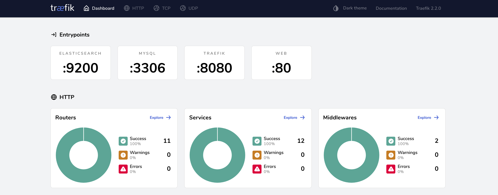

Docker Development On Mac
---

This repo tries to solve some problematics related about development using Docker and in particular on Mac Os:

* It's common, when you develop multiple projects and you have to handle multiple docker configurations, figure out how 
map containers ports in order to solve port conflicts: i.e all applications using nginx has to use the same port 80.
This problem is solved using a **reverse proxy (Traefik)** in front of all our containers.

* Docker for mac has known problems of filesystem performances, for this reasons using NFS seems to be a good workaround.
This script want to centralise the NFS docker configuration in one point, in order to be always able to set up docker
volumes for multiple project with **NFS**.

Used Technlogies:
* [NFS](https://en.wikipedia.org/wiki/Network_File_System)
* [Traefik v2.2](https://github.com/containous/traefik)

## How use it
clone this repository:
```
git clone git@github.com:zioDocker/DockerDevelopmentOnMac.git {my-project}
```

### NFS Configuration
Go in the folder **configuration/etc/exports** and add the path of the folders where your docker containers
and related volumes will run.

#### NFS script

Start nfs script:
```
chmod +x nfs-start.sh
./nfs-start.sh
```

When the scripts ends, all the folders you mentioned in the configurations are ready to be used with volumes of type 
nfs3, here an example using docker-compose volume declaration:

```
volumes:
  my-volume:
    driver: local
    driver_opts:
      type: nfs
      device: ':${PWD}'
      o: addr=host.docker.internal,rw,nolock,hard,nointr,nfsvers=3
```

**Volume options are the most important part in your volume declaration, please use the same of the example above**

### Reverse proxy (Traefik)
Run Traefik with the script:
```
chmod +x reverseProxy-start.sh
./reverseProxy-start.sh
```
This script create docker network named *reverse-proxy* that must be shared in the containers you want to be available 
on Traefik.

Now on [http://localhost:8080](http://localhost:8080) you can find Traefik dashboard where is possible to monitor 
all your running containers.
Every time you spin up a new container, this is visible immediately on Traefik.



Inside your *docker-compose* file you need to add the network *reverse-proxy*:
```
networks:
  reverse-proxy:
      external: true
```
Remember to configure labels inside your docker-compose files for your containers, i.e.:
```
 web:
    image: 'magento/magento-cloud-docker-nginx:latest'
    labels:
      - "traefik.enable=true"
      - "traefik.http.routers.my-magento-web.rule=Host(`my-magento.local`)"
      - "traefik.http.routers.my-magento-web.entrypoints=web"
    volumes: *fpmVolumes
    networks:
      - reverse-proxy
      - my-containers-network
```
All containers, to be visible outside of Traefik, has to be part of the same Traefik network: *reverse-proxy*

All containers, of the same application(i.e. inside the same docker-compose file) has to share the same network to see
each others.

### Docker-compose examples
* [magento2](docker-compose-examples/magento2.yml)

## Inspirations
- [http://nfs.sourceforge.net/](http://nfs.sourceforge.net/)
- This scipt is inspired from this 
[gist repo](https://gist.github.com/seanhandley/7dad300420e5f8f02e7243b7651c6657#file-setup_native_nfs_docker_osx-sh) 
and is resuming the solution coming from [this discussion](https://github.com/docker/for-mac/issues/1592)
- [https://www.tecmint.com/how-to-setup-nfs-server-in-linux/](https://www.tecmint.com/how-to-setup-nfs-server-in-linux/)
- [https://docs.docker.com/engine/reference/commandline/volume_create/](https://docs.docker.com/engine/reference/commandline/volume_create/)

